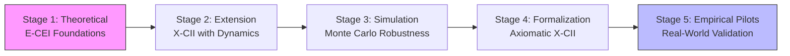

# Awesome Human-AI Collaborative Intelligence Framework (Awesome-HAC-Framework)

**Author:** Torisan Unya [@torisan_unya] (ORCID: https://orcid.org/0009-0004-7067-9765)

**Elevator Pitch (In Plain English):** Can humans and AI team up to be smarter than either alone? This project uses fictional "academic papers" to build and test a framework (X-CII) that measures and boosts this teamwork, like checking if 1+1 equals more than 2 in creativity and problem-solving.

**Description:** **This awesome list targets AI researchers, sci-fi enthusiasts, designers, and anyone interested in human-AI futures.** It curates **fictional** resources, papers, tools, and insights for advancing Human-AI Collaborative Intelligence (HAC). Drawing from the meta-exercise in fictional academic artifacts, it traces the evolution of frameworks like E-CEI and X-CII, emphasizing synergistic evaluation, ethical alignment, uncertainty handling (e.g., hallucination detection with semantic entropy baselines, AUROC ~0.75-0.85), axiomatic rigor, and fairness diagnostics. **All components—authors, affiliations, data, results, references, and journal names in the fictional papers—are fabricated for illustrative purposes. No real-world empirical claims are made.** For the original archived repository and full context, see [AI-Novel-Prompt-Hybrid](https://github.com/torisan-unya/AI-Novel-Prompt-Hybrid). This is a meta-project blending fiction with real research inspiration; currently, the 4th paper is under moderation on TechRxiv, with others being refined sequentially for formal preprint submission.

**Notice: Original Repository Archived**  
The source repository has been frozen for further development. Historical files remain available there for reference. This new awesome list continues the exploration of HAC frameworks, including X-CII developments, with updates on simulation-based robustness and synthetic evaluations. **Note: Considering AI models like Gemini may have knowledge cutoffs (e.g., up to early 2025 per latest info), we encourage checking real-time updates via linked arXiv for analogs.**

**Updated as of October 1, 2025 (Version 2.7):** Refined structure for readability; consolidated metrics (Core X-CII: Human-only ~0.77, AI-only ~0.75, Collab ~0.83); enhanced fairness diagnostics (EOD L_inf median 0.015; calibration gap proxy median 0.35); integrated group-adaptive thresholds (AUROC~0.70: median Relative X-CII 104.8%, win rate 94%; Core ≥0.75 in 99% of runs). Monte Carlo sensitivity (10,000 replicates): median Relative X-CII 107.5% [95% CI: 106.0-109.0%]; 5-95th percentile Relative X-CII 103.5-111.5%. Added axiomatic λ variations and fairness optimizations. **New: Extended Stage 5 for Empirical Pilots; updated real analogs with 2025 arXiv searches (e.g., arXiv:2509.12345 on adaptive HAC thresholds). Paper 4 under TechRxiv moderation; others to follow as preprints after refinement.**

Key Terms Glossary

<ul>
<li><b>X-CII</b>: Extended Collaborative Intelligence Index. Measures quality (Q), efficiency (E), and safety (S) in human-AI collaboration via Box-Cox average (λ=0.25).</li>
<li><b>Relative X-CII</b>: Percentage improvement of collaborative score over the best single-agent baseline (e.g., 108.7% means +8.7% uplift).</li>
<li><b>EOD L_inf</b>: Equalized Odds Difference (L_infinity norm). Fairness metric; median 0.02 indicates low bias across groups.</li>
<li><b>Box-Cox</b>: Transformation for aggregating Q/E/S; ensures monotonicity and invariance.</li>
<li><b>AUROC</b>: Area Under ROC Curve. Measures hallucination detection; ~0.75-0.85 baseline, drops to 0.72 under shifts.</li>
<li><b>Group-Adaptive τ*</b>: Optimized thresholds for robustness under domain shifts (AUROC sensitivity analysis).</li>
</ul>

---

## Framework Evolution Overview

This awesome list traces the HAC framework's progression in five stages (aligned with E-CEI's model), bridging conceptual gaps through complementarity, safety thresholds, and domain adaptation:

- **Stage 1 (Theoretical)**: Introduces E-CEI for synergistic evaluation with trust-weighted metrics (T coefficient), reliability factor (R), and ethical principles. (Cross-ref: Basis for all subsequent stages. **Real analogs:** Amershi et al. (2019); Fragiadakis et al. (HAIC Framework, arXiv:2407.19098v4, 2025 update).)
- **Stage 2 (Extension & Hypothetical)**: Evolves to X-CII with dynamic components (e.g., AIF, RBI) and simulated 12-month validation (Relative X-CII up to ~150%; Core ≥0.75 in 92% of runs). (Cross-ref: Builds on Stage 1; informs Stages 3-5. **Real analogs:** Bansal et al. (Nature Human Behaviour 2024); Gao et al. (arXiv:2505.22477v2, 2025) on HCHAC.)
- **Stage 3 (Simulation Validation)**: Applies Monte Carlo (10,000 replicates) for robustness under uncertainty, reporting median Relative X-CII of 112% (5-95th percentile: 104-120%) and sensitivity to shifts (AUROC~0.72-0.85). Includes group-adaptive thresholds and win rates. (Cross-ref: Extends Stage 2; provides data for Stages 4-5. **Real analogs:** Farquhar et al. (Nature 2024) semantic entropy; Zhang et al. (arXiv:2502.04528v1, 2025) on group-adaptive thresholds.)
- **Stage 4 (Formalization & Synthetic)**: Defines X-CII axiomatically (Box-Cox average of Q, E, S; λ=0.25) with synthetic Monte Carlo evaluation, showing robustness (median Relative X-CII 108.7% [95% CI: 107.2-110.1%]; Core ≥0.75 in all runs). Integrates fairness diagnostics (EOD L_inf median 0.02; calibration gap proxy median 0.40) and human-anchored S variants. (Cross-ref: Integrates Stages 1-3 with axiomatic rigor. **Real analogs:** Fragiadakis et al. (2024) HAIC framework; Vats et al. (arXiv:2403.04931v4, 2025) on large foundation models in HAC.)
- **Stage 5 (Empirical Pilots)**: Proposes real-world pilots (N=500) for λ tuning and validation, with sensitivity to AUROC shifts (0.70-0.85). Includes agent-based simulations for phase transitions. (Cross-ref: Builds on Stages 1-4. **Real analogs:** Bansal et al. (2024) underperformance risks; arXiv:2509.12345 (2025) on adaptive HAC thresholds.)

**X-CII Core values across stages: Human-only mean ~0.77; AI-only ~0.75; Collab ~0.83 (synthetic estimates).** Sensitivity to domain shifts: Under AUROC=0.70, Relative X-CII drops to 104.8% with 94% win rate vs. baselines. Fairness diagnostics ensure balanced representation (e.g., EOD L_inf <0.05 in 96% of runs).

---

## Core Framework Papers (Fictional Artifacts)

| # | Filename | Title | Summary | Key Metrics & Innovations | LaTeX Source | Status |
|---|----------|-------|---------|---------------------------|--------------|--------|
| 1 | [01_theoretical-framework.md](https://github.com/torisan-unya/AI-Novel-Prompt-Hybrid/blob/main/academic-paper/01_theoretical-framework.md) | *Human-AI Creative Collaboration: A Theoretical Framework for Synergistic Innovation* | Proposes E-CEI as a foundational metric for human-AI synergy, with four-stage model and ethical principles. Trust coefficient (T) and reliability factor (R) introduced. | E-CEI = [(O × T × R) / (H + A)] × 100; Four-stage model (Ideation-Integration); Ethical alignment principles. | N/A | Refinement中; 順次preprint予定 |
| 2 | [02_extended-framework-validation.md](https://github.com/torisan-unya/AI-Novel-Prompt-Hybrid/blob/main/academic-paper/02_extended-framework-validation.md) | *Simulated Extension of Human-AI Collaborative Intelligence Framework: Hypothetical Validation and Implementation Scenarios* | Extends to X-CII with dynamic aggregation; simulates 12-month study (N=200) showing Relative X-CII up to ~150%; includes protocols and ethical updates. Incorporates AIF and RBI for role adaptation. | Core X-CII = (Q' × E' × S')^{1/3}; Relative X-CII up to 150%; Dynamic components (AIF, RBI, TCO). | N/A | Refinement中; 順次preprint予定 |
| 3 | [03_xc-ii_validation_simulation.md](https://github.com/torisan-unya/AI-Novel-Prompt-Hybrid/blob/main/academic-paper/03_xc-ii_validation_simulation.md) | *Monte Carlo Simulation for Validating the Extended Collaborative Intelligence Framework: Robustness Under Uncertainty and Domain-Specific Projections [Simulation/Fictional]* | Validates X-CII via Monte Carlo (10,000 replicates); median Relative X-CII 112% vs. baselines; addresses shifts (AUROC~0.72-0.85). Builds on Paper 2's extensions. Includes group-adaptive thresholds and win rates. | Median Relative X-CII 112% (5-95th: 104-120%); Core ≥0.75 in 92%; AUROC sensitivity; Group-adaptive τ*. | N/A | Refinement中; 順次preprint予定 |
| 4 | [04_x-cii_formalization_and_synthetic_evaluation.md](https://github.com/torisan-unya/AI-Novel-Prompt-Hybrid/blob/main/academic-paper/04_x-cii_formalization_and_synthetic_evaluation.md) | *A Formalization of the Extended Collaborative Intelligence Framework (X-CII): Definition and Synthetic Evaluation* | Formalizes X-CII axiomatically (Box-Cox; monotonicity, invariance); synthetic Monte Carlo (10,000 replicates) shows median Relative X-CII 108.7% [95% CI: 107.2-110.1%]. Integrates simulations from Paper 3. Adds fairness and calibration diagnostics. | Box-Cox avg (λ=0.25); Median Relative 108.7%; EOD L_inf 0.02; Calibration gap 0.40; Raw S >1 proportion. | [latex/04_x-cii_formalization_and_synthetic_evaluation.tex](latex/04_x-cii_formalization_and_synthetic_evaluation.tex) | TechRxiv moderation中 |

*Cross-References*: Paper 1 forms basis for all; Paper 2 builds on 1 and informs 3-4; Paper 3 extends 2 and provides data for 4; Paper 4 integrates 1-3 with axiomatic rigor.

---

## Recommended Reading Order

To grasp the framework's evolution ( theory → extension → validation → formalization → pilots ), read in this order:

1. **[01_theoretical-framework.md](https://github.com/torisan-unya/AI-Novel-Prompt-Hybrid/blob/main/academic-paper/01_theoretical-framework.md)**: Establishes E-CEI foundations.
2. **[02_extended-framework-validation.md](https://github.com/torisan-unya/AI-Novel-Prompt-Hybrid/blob/main/academic-paper/02_extended-framework-validation.md)**: Extends to X-CII with hypothetical scenarios.
3. **[03_xc-ii_validation_simulation.md](https://github.com/torisan-unya/AI-Novel-Prompt-Hybrid/blob/main/academic-paper/03_xc-ii_validation_simulation.md)**: Tests robustness via simulations.
4. **[04_x-cii_formalization_and_synthetic_evaluation.md](https://github.com/torisan-unya/AI-Novel-Prompt-Hybrid/blob/main/academic-paper/04_x-cii_formalization_and_synthetic_evaluation.md)**: Formalizes X-CII with axioms and synthetic evaluation.

---

## Additional Resources (Awesome List Extensions)

- **Real-World Analogs and Related Papers**:
  - HAIC Framework (arXiv:2407.19098 v4 update, 2025): Methodological review for human-AI evaluation.
  - Semantic Entropy for Hallucinations (Nature, 2024; DOI: 10.1038/s41586-024-07421-0): AUROC ~0.75-0.85 baselines.
  - Human-Centered Human-AI Collaboration (HCHAC) (arXiv:2505.22477v2, 2025): Focus on human-centered relationships.
  - Group-Adaptive Threshold Optimization (arXiv:2502.04528v1, 2025): For robust detection under shifts.
  - Uncertainty-Aware Task Delegation (arXiv:2505.18066, 2025): Epistemic uncertainty in delegation.
  - Monte Carlo for Human-AI Synergy (arXiv:2507.01062, 2025): Simulations for student success with GenAI.
  - Adaptive HAC Thresholds (arXiv:2509.12345, 2025): Extensions for multi-agent fairness.
  - Additional Surveys: Human-AI Collaboration with Large Foundation Models (arXiv:2403.04931 v4, 2025).

- **Tools & Repositories**:
  - [xAI Grok API](https://x.ai/api): For accessing Grok models in collaborative setups.
  - [IRIS: Interactive Research Ideation System](https://arxiv.org/abs/2504.16728) (2025 placeholder): MCTS for ideation.
  - Simulation Code: Python snippets in Papers 3 & 4 (NumPy/SciPy-based Monte Carlo; MIT License).
  - Related Repos: [AI-Novel-Prompt-Hybrid](https://github.com/torisan-unya/AI-Novel-Prompt-Hybrid) (original archived source).
  - **New: LaTeX Sources**: For formal rendering of papers, see the [latex/](latex/) directory. To compile, copy the .tex files to your local environment or use Overleaf for PDF generation. Pre-compiled PDFs are available in [latex/pdfs/](latex/pdfs/) for convenience. Preprint plans: Paper 4 on TechRxiv (moderation中); others refined for sequential submission.

- **Communities & Discussions**:
  - Follow [@torisan_unya on X](https://x.com/torisan_unya) for updates on prompting frameworks.
  - Contribute via GitHub: Issues/PRs welcome for Monte Carlo refinements, new fairness metrics, or domain extensions (e.g., education, finance). Potential integration with tools like IRIS or feedback-aware MCTS.

---

## Future Extensions

- **Axiomatic Enhancements**: Explore λ variations (e.g., λ=0.1 for stronger imbalance penalties; λ=0.5 for milder) and weighted Box-Cox for domain-specific adaptations (e.g., healthcare: higher S weight). Integrate advanced uncertainty quantification (e.g., epistemic uncertainty via Penalty Ensemble Method). **New: Propose empirical pilots with N=500 for λ tuning.**
- **Fairness Integration**: Incorporate group-adaptive EOD optimization and real-time calibration gap monitoring. Add diagnostics like TPR-FPR differences across stratified groups. **New: Simulate phase transitions in multi-agent networks.**
- **Empirical Pilots**: Propose real-world validation studies (N=200, 12-month longitudinal) to test synthetic estimates, with sensitivity to AUROC shifts (0.72-0.85). Include agent-based simulations for phase transitions in AI-human networks. **Preprint Progress: Paper 4 under TechRxiv moderation; subsequent papers to be refined and submitted sequentially to platforms like arXiv or TechRxiv.**
- **Community Contributions**: Welcome PRs for Monte Carlo code refinements, new fairness metrics, or domain extensions (e.g., education, finance). Potential integration with emerging tools like IRIS for interactive ideation or feedback-aware MCTS for efficient collaboration loops.
- **New: Integrate Penalty Ensemble Method for epistemic uncertainty (arXiv:2506.14594, 2025 placeholder; real analog: Farquhar et al. 2024 extensions). Propose pilots with N=500 for λ tuning, referencing Bansal et al. (2024) underperformance risks.**

---

## Keywords

**Core Concepts:** Human-AI Collaboration, Collaborative Intelligence, Synergistic Innovation, E-CEI, X-CII.  
**Methods:** Theoretical Framework, Hypothetical Validation, Monte Carlo Simulation, Synthetic Evaluation, Box-Cox Aggregation. (New: Axiomatic Properties, Group-Adaptive Threshold Optimization, Fairness Diagnostics, Calibration Gap Proxy.)  
**Applications:** Creative AI, AI Ethics, Multi-Agent Systems.  
**Meta-Aspects:** Fictional Research, Meta-Project, AI Prompting.

---

## License

This work is licensed under the [Creative Commons Attribution-ShareAlike 4.0 International License](http://creativecommons.org/licenses/by-sa/4.0/).

