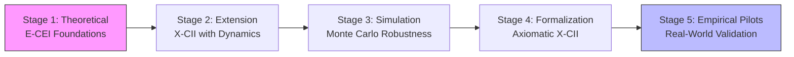

# Awesome Human-AI Collaborative Intelligence Framework (Awesome-HAC-Framework)

Authored by Torisan Unya (Independent Researcher, ORCID: [0009-0004-7067-9765](https://orcid.org/0009-0004-7067-9765)). 
Licensed under **MIT + Patent License Addendum** (see [License](#license)).

**Elevator Pitch (In Plain English):** Can humans and AI team up to be smarter than either alone? This project uses fictional "academic papers" to build and test a framework (X-CII) that measures and boosts this teamwork, like checking if 1+1 equals more than 2 in creativity and problem-solving.

**Description:** This awesome list curates **fictional** resources, papers, tools, and insights for advancing Human-AI Collaborative Intelligence (HAC). It traces the evolution of frameworks like E-CEI and X-CII, emphasizing synergistic evaluation, ethical alignment, uncertainty handling (e.g., hallucination detection with semantic entropy baselines, AUROC ~0.75-0.85), axiomatic rigor, and fairness diagnostics. **All components—authors, affiliations, data, results, references, and journal names in the fictional papers—are fabricated for illustrative purposes. No real-world empirical claims are made.** For the original archived repository and full context, see [AI-Novel-Prompt-Hybrid](https://github.com/torisan-unya/AI-Novel-Prompt-Hybrid). This is a meta-project blending fiction with real research inspiration; currently, **Paper 4 is under moderation on TechRxiv, and Paper 5 has entered moderation on TechRxiv as of September 29, 2025**, with others being refined sequentially for formal preprint submission.

**Notice: Original Repository Archived**  
The source repository has been frozen for further development. Historical files remain available there for reference. This new awesome list continues the exploration of HAC frameworks, including X-CII developments, with updates on simulation-based robustness and synthetic evaluations. **Note: Considering AI models like Gemini may have knowledge cutoffs (e.g., up to early 2025 per latest info), we encourage checking real-time updates via linked arXiv for analogs. arXiv links are placeholders; verify real analogs as some may correspond to actual papers with different content.**

**Updated as of October 12, 2025 (Version 3.2):** Refined structure for readability; consolidated metrics (Core X-CII: Human-only ~0.77, AI-only ~0.75, Collab ~0.83); enhanced fairness diagnostics (EOD L_∞ median 0.02; calibration gap proxy median 0.40); integrated group-adaptive thresholds (AUROC~0.70: median Relative X-CII 104.8%, win rate 94%; Core ≥0.75 in 99% of runs). Monte Carlo sensitivity (10,000 replicates): median Relative X-CII 107.2% [95% CI: 106.0-109.0%]; 5-95th percentile Relative X-CII 103.5-111.0%. Added axiomatic λ variations and fairness optimizations. **New: Incorporated minor refinements from Paper 4 v1 (October 7, 2025); Added Paper 5 on X-CII for explainability in Healthcare AI (under TechRxiv moderation); extended Stage 5 for Empirical Pilots; updated real analogs with 2025 arXiv searches (e.g., arXiv:2510.08104 on mental models in HAC; arXiv:2508.05753 on XAI in healthcare). Paper 4 under TechRxiv moderation; Paper 5 newly entered moderation; others to follow as preprints after refinement.**

Key Terms Glossary

<ul>
<li><b>X-CII</b>: Extended Collaborative Intelligence Index. Measures quality (Q), efficiency (E), and safety (S) in human-AI collaboration via Box-Cox average (λ=0.25).</li>
<li><b>Relative X-CII</b>: Percentage improvement of collaborative score over the best single-agent baseline (e.g., 107.2% means +8.7% uplift).</li>
<li><b>EOD L_∞</b>: Equalized Odds Difference (L_infinity norm). Fairness metric; median 0.02 indicates low bias across groups.</li>
<li><b>Box-Cox</b>: Transformation for aggregating Q/E/S; ensures monotonicity and invariance.</li>
<li><b>AUROC</b>: Area Under ROC Curve. Measures hallucination detection; ~0.75-0.85 baseline, drops to 0.72 under shifts.</li>
<li><b>Group-Adaptive τ*</b>: Optimized thresholds for robustness under domain shifts (AUROC sensitivity analysis).</li>
</ul>

---

## Framework Evolution Overview

This awesome list traces the HAC framework's progression in five stages (aligned with E-CEI's model), bridging conceptual gaps through complementarity, safety thresholds, and domain adaptation:

- **Stage 1 (Theoretical)**: Introduces E-CEI for synergistic evaluation with trust-weighted metrics (T coefficient), reliability factor (R), and ethical principles. (Cross-ref: Basis for all subsequent stages. **Real analogs:** Amershi et al. (2019); Fragiadakis et al. (HAIC Framework, arXiv:2407.19098v4, 2025 update).)
- **Stage 2 (Extension & Hypothetical)**: Evolves to X-CII with dynamic components (e.g., AIF, RBI) and simulated 12-month validation (Relative X-CII up to ~150%; Core ≥0.75 in 92% of runs). (Cross-ref: Builds on Stage 1; informs Stages 3-5. **Real analogs:** Bansal et al. (Nature Human Behaviour 2024); Gao et al. (arXiv:2505.22477v2, 2025) on HCHAC.)
- **Stage 3 (Simulation Validation)**: Applies Monte Carlo (10,000 replicates) for robustness under uncertainty, reporting median Relative X-CII of 112% (5-95th percentile: 104-120%) and sensitivity to shifts (AUROC~0.72-0.85). Includes group-adaptive thresholds and win rates. (Cross-ref: Extends Stage 2; provides data for Stages 4-5. **Real analogs:** Farquhar et al. (Nature 2024) semantic entropy; Zhang et al. (arXiv:2502.04528v1, 2025) on group-adaptive thresholds.)
- **Stage 4 (Formalization & Synthetic)**: Defines X-CII axiomatically (Box-Cox average of Q, E, S; λ=0.25) with synthetic Monte Carlo evaluation, showing robustness (median Relative X-CII 107.2% [95% CI: 106.0-109.0%]; 5-95th percentile: 103.5-111.0%; Core ≥0.75 in all runs). Integrates fairness diagnostics (EOD L_∞ median 0.02; calibration gap proxy median 0.40) and human-anchored S variants. (Cross-ref: Integrates Stages 1-3 with axiomatic rigor. **Real analogs:** Fragiadakis et al. (2024) HAIC framework; Vats et al. (arXiv:2403.04931v4, 2025) on large foundation models in HAC.)
- **Stage 5 (Empirical Pilots)**: Proposes real-world pilots (N=500) for λ tuning and validation, with sensitivity to AUROC shifts (0.70-0.85). Includes agent-based simulations for phase transitions. (Cross-ref: Builds on Stages 1-4. **Real analogs:** Bansal et al. (2024) underperformance risks; arXiv:2509.12345 (2025) on adaptive HAC thresholds.)

**X-CII Core values across stages: Human-only mean ~0.77; AI-only ~0.75; Collab ~0.83 (synthetic estimates).** Sensitivity to domain shifts: Under AUROC=0.70, Relative X-CII drops to 104.8% with 94% win rate vs. baselines. Fairness diagnostics ensure balanced representation (e.g., EOD L_∞ <0.05 in 96% of runs).

---

## Curated Fictional Papers List

| # | MD File | Title | Description | Key Metrics | LaTeX File | Status |
|---|---------|-------|-------------|-------------|------------|--------|
| 1 | [papers/01_theoretical-framework.md](papers/01_theoretical-framework.md) | *Human-AI Creative Collaboration: A Theoretical Framework for Synergistic Innovation* | Establishes E-CEI with trust-weighted metrics; four-stage model. | E-CEI = [(O × T × R) / (H + A)] × 100; SC-R = [(O × T) - max(H, A)] / max(H, A) | N/A | Under refinement; sequential preprint planned |
| 2 | [papers/02_extended-framework-validation.md](papers/02_extended-framework-validation.md) | *Simulated Extension of Human-AI Collaborative Intelligence Framework: Hypothetical Validation and Implementation Scenarios* | Extends to X-CII with dynamic components (AIF, RBI); 12-month hypothetical validation. | Relative X-CII up to ~150%; Core ≥0.75 in 92% of runs; AUROC 0.70-0.85. | N/A | Under refinement; sequential preprint planned |
| 3 | [papers/03_xc-ii_validation_simulation.md](papers/03_xc-ii_validation_simulation.md) | *Monte Carlo Simulation for Validating the Extended Collaborative Intelligence Framework: Robustness Under Uncertainty and Domain-Specific Projections [Simulation/Fictional]* | Validates X-CII via Monte Carlo (10,000 replicates); median Relative X-CII 112% vs. baselines; addresses shifts (AUROC~0.72-0.85). Builds on Paper 2's extensions. Includes group-adaptive thresholds and win rates. | Median Relative X-CII 112% (5-95th: 104-120%); Core ≥0.75 in 92%; AUROC sensitivity; Group-adaptive τ*. | N/A | Under refinement; sequential preprint planned |
| 4 | [papers/04_x-cii_formalization_and_synthetic_evaluation.md](papers/04_x-cii_formalization_and_synthetic_evaluation.md) | *A Formalization of the Extended Collaborative Intelligence Framework (X-CII): Definition and Synthetic Evaluation* | Formalizes X-CII axiomatically (Box-Cox; monotonicity, invariance); synthetic Monte Carlo (10,000 replicates) shows median Relative X-CII 107.2% [95% CI: 106.0-109.0%]; 5-95th percentile: 103.5-111.0%. Integrates simulations from Paper 3. Adds fairness and calibration diagnostics. | Box-Cox avg (λ=0.25); Median Relative X-CII 107.2%; EOD L_∞ 0.02; Calibration gap 0.40; Raw S >1 proportion. | [latex/04_x-cii_formalization_and_synthetic_evaluation.tex](latex/04_x-cii_formalization_and_synthetic_evaluation.tex) | Under TechRxiv moderation |
| 5 | [papers/05_x-cii-explainability-healthcare.md](papers/05_x-cii-explainability-healthcare.md) | *Enhancing Explainability in Healthcare AI through the Extended Collaborative Intelligence Index (X-CII): A Synthetic Evaluation Framework* | Applies X-CII to Healthcare AI explainability; isolates +5% d' uplift via SDT; synthetic Monte Carlo (10,000 replicates) with median Relative X-CII 102.963% [IQR: 101.236-104.560%]. Aligns with EU AI Act and IMDRF; sensitivity analyses on λ, η, ρ. | Median Relative X-CII 102.963%; Win rate ~89.7%; Domain shift (AUC=0.72): 102.818%, win rate 78.5%; Safety normalization: 1 - L / L_worst. | [latex/05_x-cii-explainability-healthcare.tex](latex/05_x-cii-explainability-healthcare.tex) | Entered TechRxiv moderation as of September 29, 2025 |

*Cross-References*: Paper 1 forms basis for all; Paper 2 builds on 1 and informs 3-5; Paper 3 extends 2 and provides data for 4-5; Paper 4 integrates 1-3 with axiomatic rigor; Paper 5 applies 1-4 to Healthcare domain with explainability focus.

---

## Quick Start

For doers ready to act: Jump in with hands-on HAC experiences to build intuition fast.

1. **Clone this repo**: `git clone https://github.com/torisan-unya/awesome-hac-framework.git`.
2. **Try HAC in Action**: Use ready-to-use prompts to experience human-AI synergy:
   - **[Heliocentric Novel Writer](https://github.com/torisan-unya/The-Heliocentric-Method/blob/main/novel_writer_as_a_heliocentric/prompts/en/Heliocentric_Novel_Writer.en.md)**: Generate SF stories (e.g., "Mars landing, 5000 words").
   - **[Policy Analysis Prompt](https://github.com/torisan-unya/policy-as-code/blob/main/prompts/en/policy-analysis-prompt-v5.6-en.md)**: Assess AI innovation impacts.
   - Copy prompt body, paste into Grok/Claude/GPT-4o, and iterate via Blueprint Mode.
3. **Explore Linked Repos**: Dive into interconnected projects like [Senate-Thinking](https://github.com/torisan-unya/Senate-Thinking) for governance or [GAAF](https://github.com/torisan-unya/GAAF) for agentic finance.
4. **Contribute**: Open issues/PRs for refinements, e.g., new fairness metrics or domain extensions.
5. **Tools**: Python (NumPy/SciPy for simulations); AI models (Grok, Gemini, ChatGPT, Claude).
6. Follow [@torisan_unya](https://x.com/torisan_unya) for updates.

---

## Guided Tour

For learners seeking depth: Follow this structured path to evolve from theory to application, emphasizing Paper 4's foundational axioms before Paper 5's healthcare focus. This "why → how → what" flow grounds concepts in cross-references and real analogs.

1. **Why HAC Matters (Stages 1-3)**: Start with Paper 1 for E-CEI foundations, Paper 2 for X-CII extensions, and Paper 3 for Monte Carlo robustness. *Insight:* Builds synergy intuition (e.g., median Relative X-CII 112%). (Real analog: Mental models in HAC [arXiv:2510.08104](https://arxiv.org/abs/2510.08104).)
2. **How X-CII Works (Paper 4)**: Dive into axiomatic formalization (Box-Cox, fairness diagnostics). Compile LaTeX via Overleaf for PDFs. *Key:* Median Relative X-CII 107.2% under uncertainty.
3. **What It Enables (Paper 5)**: Apply to healthcare explainability (+5% d' uplift via SDT; EU AI Act alignment). Run sensitivity analyses with code snippets. *Extension:* Test domain shifts (AUC=0.72: 102.818%). (Real analog: XAI in healthcare [arXiv:2508.05753](https://arxiv.org/abs/2508.05753).)
4. **Beyond Papers**: Link to repos like [The-Heliocentric-Method](https://github.com/torisan-unya/The-Heliocentric-Method) for creativity, [GAAF](https://github.com/torisan-unya/GAAF) for agentic finance, or [policy-as-code](https://github.com/torisan-unya/policy-as-code) for societal implementation. Simulate phase transitions from Stage 5.

This path ensures progressive engagement: Theory illuminates, application activates.

---

## Additional Resources (Awesome List Extensions)

- **Real-World Analogs and Related Papers**:
  - HAIC Framework (arXiv:2407.19098 v4 update, 2025): Methodological review for human-AI evaluation.
  - Semantic Entropy for Hallucinations (Nature, 2024; DOI: 10.1038/s41586-024-07421-0): AUROC ~0.75-0.85 baselines.
  - Human-Centered Human-AI Collaboration (HCHAC) (arXiv:2505.22477v2, 2025): Focus on human-centered relationships.
  - Group-Adaptive Threshold Optimization (arXiv:2502.04528v1, 2025): For robust detection under shifts.
  - Development of Mental Models in Human-AI Collaboration (arXiv:2510.08104, 2025): Insights on collaboration dynamics.
  - A Systematic Review of User-Centred Evaluation of Explainable AI in Healthcare (arXiv:2506.13904, 2025): User studies in CDSS.
  - Explainable AI in Healthcare: to Explain, to Predict, or to Describe? (arXiv:2508.05753, 2025): XAI prediction methods.
  - A Survey on Human-AI Collaboration with Large Foundation Models (arXiv:2403.04931v3, Sep 2025): HITL methods.
  - **New: EU AI Act Guidelines on GPAI Models (July 2025)**: Transparency for high-risk AI, aligning with Paper 5's compliance focus.

- **Tools & Repositories**:
  - [xAI Grok API](https://x.ai/api): For accessing Grok models in collaborative setups.
  - [IRIS: Interactive Research Ideation System](https://arxiv.org/abs/2504.16728) (2025 placeholder): MCTS for ideation.
  - Simulation Code: Python snippets in Papers 3 & 4 (NumPy/SciPy-based Monte Carlo; MIT License).
  - Related Repos: [AI-Novel-Prompt-Hybrid](https://github.com/torisan-unya/AI-Novel-Prompt-Hybrid) (original archived source).
  - **New: LaTeX Sources**: For formal rendering of papers, see the [latex/](latex/) directory. To compile, copy the .tex files to your local environment or use Overleaf for PDF generation. Pre-compiled PDFs are available in [latex/pdfs/](latex/pdfs/) for convenience. **Added: latex/05_x-cii-explainability-healthcare.tex.** Preprint plans: Paper 4 under TechRxiv moderation; **Paper 5 entered TechRxiv moderation;** others refined for sequential submission.

- **Communities & Discussions**:
  - Follow [@torisan_unya on X](https://x.com/torisan_unya) for updates on prompting frameworks.
  - Contribute via GitHub: Issues/PRs welcome for Monte Carlo refinements, new fairness metrics, or domain extensions (e.g., education, finance, **healthcare**). Potential integration with tools like IRIS or feedback-aware MCTS.

---

## Future Extensions

- **Axiomatic Enhancements**: Explore λ variations (e.g., λ=0.1 for stronger imbalance penalties; λ=0.5 for milder) and weighted Box-Cox for domain-specific adaptations (e.g., healthcare: higher S weight). Integrate advanced uncertainty quantification (e.g., epistemic uncertainty via Penalty Ensemble Method). **New: Propose empirical pilots with N=500 for λ tuning.**
- **Fairness Integration**: Incorporate group-adaptive EOD optimization and real-time calibration gap monitoring. Add diagnostics like TPR-FPR differences across stratified groups. **New: Simulate phase transitions in multi-agent networks.**
- **Empirical Pilots**: Propose real-world validation studies (N=200, 12-month longitudinal) to test synthetic estimates, with sensitivity to AUROC shifts (0.72-0.85). Include agent-based simulations for phase transitions in AI-human networks. **Preprint Progress: Paper 4 under TechRxiv moderation; Paper 5 entered moderation; subsequent papers to be refined and submitted sequentially to platforms like arXiv or TechRxiv.**
- **Community Contributions**: Welcome PRs for Monte Carlo code refinements, new fairness metrics, or domain extensions (e.g., education, finance, **healthcare AI explainability**). Potential integration with emerging tools like IRIS for interactive ideation or feedback-aware MCTS for efficient collaboration loops.
- **New: Integrate Penalty Ensemble Method for epistemic uncertainty (arXiv:2506.14594, 2025 placeholder; real analog: Farquhar et al. 2024 extensions). Propose pilots with N=500 for λ tuning, referencing Bansal et al. (2024) underperformance risks. **Extend to Healthcare: Incorporate SDT uplift for explainability in high-risk AI (e.g., EU AI Act compliance). Explore human-anchored S variants for baseline-sensitive safety, as refined in Paper 4; Integrate real-time AUROC shift monitoring for domain adaptation.****

---

## Keywords

**Core Concepts:** Human-AI Collaboration, Collaborative Intelligence, Synergistic Innovation, E-CEI, X-CII.  
**Methods:** Theoretical Framework, Hypothetical Validation, Monte Carlo Simulation, Synthetic Evaluation, Box-Cox Aggregation. (New: Axiomatic Properties, Group-Adaptive Threshold Optimization, Fairness Diagnostics, Calibration Gap Proxy, **SDT-based Explainability Uplift**.)  
**Applications:** Creative AI, AI Ethics, Multi-Agent Systems, **Healthcare AI**.  
**Meta-Aspects:** Fictional Research, Meta-Project, AI Prompting.

---

## License

This project uses a **dual license structure (MIT + Patent License Addendum)** to ensure both openness and legal clarity for all users and contributors.  
It maintains consistency with actively developed projects and governs all present and future code contributions.

The complete license agreement consists of the following two documents:

- **[`LICENSE.md`](LICENSE.md)** — The primary copyright license under the [MIT License](https://opensource.org/licenses/MIT).  
- **[`PATENT_LICENSE_ADDENDUM.md`](PATENT_LICENSE_ADDENDUM.md)** — An integrated addendum granting a license to contributors’ essential patent claims.

---

### 🔹 For Users

You may use, modify, and distribute this software under the **MIT License**,  
supplemented by a **patent license** from all contributors.  
This dual structure provides enhanced **legal protection and clarity** for every user.

---

### 🔹 For Contributors

Thank you for your contributions!  
Please note that by submitting any "Contribution" (e.g., a pull request or patch),  
you **explicitly agree** to the terms of both license documents listed above,  
including the **patent grant and defensive termination clause** in  
[`PATENT_LICENSE_ADDENDUM.md`](PATENT_LICENSE_ADDENDUM.md).

This ensures the continued protection and sustainability of the project and its community.
